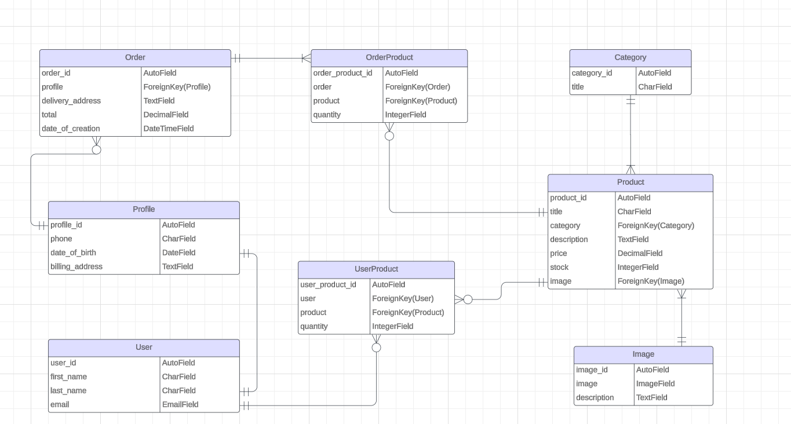

The project is about an online store specialised in laboratory glassware. It has been written in Django. 
It consists of two externally developed applications, namely 'store' and 'accounts'. The former deals with content 
of the shop (categories, products and their images) whereas the latter with customers and their actions (storing their
personal data, filling up shopping carts and placing orders).

To get a better idea about architecture of the project, I present here the corresponding ER diagram. 
Three boxes on the right hand side represent application 'store' whereas the remainder represent application 'accounts'.

After opening the project in a browser, the home page immediately loads up:

The project is suited to any customer, no matter whether they or willing to register or not. However, as the project
is not fully developed at the current stage (26/7/2024), some functionalities are missing. 
Specifically, anonymous (not registered) cannot place orders. Yet they can still use their shopping cart. 
For the reason of not getting them upset, the function of the shopping cart is temporarily disabled for them.

For a programmer, it is a good practice to predict potential issues with malfunctioning of the software and address them
before they actually happen. A good example are errors caused by reloading a page at any stage of filling up the cart
with products or at the subsequent checkout. Another good practice is to make sure that a customer cannot order a 
particular product in a larger quantity than is actually available. They are given a proper notice before they place
their order.
